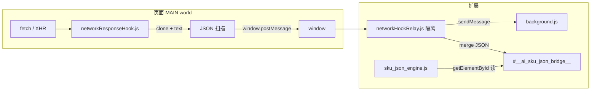

# 网络响应 Hook 架构（Request Hook）

## 1. 为何不能只在「隔离」content script 里 Hook？

Chrome 扩展的 **隔离世界（isolated world）** 与页面 **MAIN world** 不是同一个 JavaScript 环境。页面里的 `fetch` / `XMLHttpRequest` 在 MAIN 中执行；在隔离 content script 里改写 `window.fetch` **不会**拦截到站点自己的请求。

因此：

- **Hook 脚本**：必须在 **`world: "MAIN"`** 下注入，且尽量 **`document_start`**，抢在业务脚本之前包装 `fetch` / `XHR`。
- **Relay 脚本**：普通 content script（隔离世界），用 **`window.postMessage`** 接收 MAIN 发来的摘要，再调用 **`chrome.runtime.sendMessage`** 发给 **service worker**，并写入 **`#__ai_sku_json_bridge__`** 供 `sku_json_engine.js` 读取。

## 2. 架构总览

## 3. Manifest 配置要点

- **`hooks/networkResponseHook.js`**：`run_at: "document_start"`，`world: "MAIN"`，`matches: http(s)://*/*`
- **`hooks/networkHookRelay.js`**：同上 URL，`document_start`（默认隔离世界）
- 需 **`minimum_chrome_version: "111.0"`**（MAIN world 的 `content_scripts`）

详见仓库内 `manifest.json`。

## 4. Response clone 方案（fetch）

- 在 `fetch` 包装器里对 **`res.clone()`** 再 `.text()`，避免消费原始 body stream。
- **始终 `return` 原始 `res`**，页面逻辑与缓存、重定向行为不变。
- 仅对疑似 JSON / JSONP 的 `Content-Type` 或 URL（含 `mtop`、`.json` 等）做异步读取，失败静默吞掉。

## 5. XHR 方案

- 包装 `open` 记录 URL / method，`send` 上挂 `load` 监听。
- 仅在 `responseType` 为空、`text` 或 `json`（部分站点）时读 `responseText`（json 类型在少数环境可读，读不到则跳过）。
- 不修改响应，不改变调用方同步语义。

## 6. JSON 自动扫描

1. 先做短前缀判断（约前 8KB）是否可能出现 `sku` / `product` / `price` / `inventory` / `quantity`，减少 CPU。
2. `JSON.parse` 失败则按 JSONP 规则剥外壳再解析。
3. 对解析后的对象 **深度优先** 遍历（深度/节点数上限），对每个 **普通对象** 根据 **自身 key 名** 匹配语义标签：`skuid`、`sku`、`product`/`itemid`、`price`、`inventory`/`stock`、`quantity`/`qty`。
4. 命中规则示例：**至少 2 类标签**，或含 **`skuid`**，或 **`sku` + (`price`|`inventory`|`quantity`)**。
5. 命中节点序列化为 **预览字符串**（长度上限），随 `postMessage` 传出，避免整包巨 JSON 卡死页面。

## 7. 防影响页面原逻辑

- `fetch`：**链式 `.then` 只挂旁路**，主链仍返回原生 `Response`。
- `XHR`：仅 `addEventListener('load')`，不改写 `onreadystatechange` / 不替换 `response` 对象。
- 解析、扫描、postMessage 全部 **`try/catch`**，异步错误不冒泡。
- **限流**：滑动窗口内限制 postMessage 次数，防止极端站点打满 IPC。

## 8. 后台与采集联动

- `background.js` 收到 `NET_SKU_HOOK`，写入内存环形队列（排障用，不持久化）。
- Relay 将快照合并进 `__ai_sku_json_bridge__.__networkSkuSnapshots`。
- `sku_json_engine.js` 在 AliExpress 检测时 **优先合并** `aliExpressNetHookOnlySources()`，不依赖 URL 必须含 `mtop` 子串。

## 9. 文件清单

| 文件 | 作用 |
|------|------|
| `hooks/networkResponseHook.js` | MAIN world：Hook + 扫描 + `postMessage` |
| `hooks/networkHookRelay.js` | 隔离 world：校验、写 bridge、`sendMessage` |
| `background.js` | `NET_SKU_HOOK` 环形缓冲 |
| `sku_json_engine.js` | 消费 `__networkSkuSnapshots` |
| `manifest.json` | 注册上述 content_scripts 顺序 |

## 10. 局限说明

- **子帧 / iframe**：当前与现有扩展一致，主要处理 **顶层 frame**；跨域子帧需单独 `all_frames` 策略（未默认开启，以免性能与安全风险）。
- **二进制 / 流式 body**：不扫描；仅文本 JSON / JSONP。
- **页面恶意 postMessage**：Relay 校验 `source`、`v`、`hits[].preview` 类型与长度，降低污染 bridge 的风险。
